# Semi-Prefill Overhead 分析报告（agentbench_ltp，Prefix Caching 场景）

## 1 实验概述

| 参数 | 值 |
|------|-----|
| 模型 | Llama-3.3-70B-Instruct |
| 上下文窗口 (cw) | 32,000 tokens |
| 压缩阈值 (threshold) | 30,000 tokens |
| 保留最近 (keep_recent) | 2,800 tokens |
| 摘要上限 (summary_max) | 1,024 tokens |
| 预留 (reserve) | 2,000 tokens |
| 有效样本数 | 12 / 12 |
| 配置来源 | /root/agentbench_semi_prefill_bench/config.py |

**硬件参数（理论模型，与 cw8000 参考报告保持一致）**

| 符号 | 含义 | 值 | 来源 |
|------|------|-----|------|
| $r_{pf}$ | Prefill 速率 | 0.15 ms/tok | cw8000 参考报告 |
| $r_{dec}$ | Decode 速率 | 12.0 ms/tok | cw8000 参考报告 |
| $c_{fix}$ | 请求固定开销 | 20 ms | cw8000 参考报告 |

**异步压缩 vs 同步压缩**

| 模式 | 含义 | 关键路径上的压缩成本 |
|------|------|-------------------|
| **Async（异步摘要）** | 摘要在后台/空闲时预生成，不阻塞用户请求 | 仅 Semi-Prefill：$(B_2+C_1) \times r_{pf} + c_{fix}$ |
| **Sync（同步摘要）** | 摘要在压缩触发时同步生成，用户必须等待 | Summary Prefill $B_1 \times r_{pf}$ + Summary Decode $B_2 \times r_{dec}$ + Semi-Prefill |

> compressed 目录缺少 run_config.json；context/threshold 参数来自 /root/agentbench_semi_prefill_bench/config.py 的 32k 配置。

---

## 2 Agent 工作负载统计

### 2.1 基本统计

| 指标 | 值 |
|------|-----|
| 总轮数 | 278 |
| LLM calls | 556 |
| 压缩次数 | 37 |
| 压缩率 | 13.3% |
| 平均压缩/请求 | 3.08 |
| 平均 rounds/请求 | 23.17 |
| 平均累计上下文 | 440,442 tokens |
| 累计/首轮范围 | 3.6×–23.0× |

| 样本 | 总轮数 | 压缩次数 | 压缩率 | δ 中位数 | ctx max | 累计 ctx | 累计/首轮 |
| --- | --- | --- | --- | --- | --- | --- | --- |
| P0 | 25 | 3 | 12.0% | 4,613 | 29,706 | 477,302 | 22.01 |
| P1 | 25 | 3 | 12.0% | 4,704 | 28,440 | 459,366 | 21.19 |
| P10 | 25 | 3 | 12.0% | 2,562 | 30,294 | 498,957 | 23.01 |
| P11 | 3 | 0 | 0.0% | 2,512 | 26,703 | 78,534 | 3.62 |
| P2 | 25 | 4 | 16.0% | 4,834 | 29,838 | 472,201 | 21.76 |
| P3 | 25 | 3 | 12.0% | 2,217 | 29,820 | 475,188 | 21.89 |
| P4 | 25 | 3 | 12.0% | 4,269 | 29,626 | 500,191 | 23.03 |
| P5 | 25 | 4 | 16.0% | 4,662 | 29,158 | 477,128 | 22.00 |
| P6 | 25 | 3 | 12.0% | 2,459 | 30,220 | 469,565 | 21.65 |
| P7 | 25 | 3 | 12.0% | 4,387 | 29,778 | 463,284 | 21.37 |
| P8 | 25 | 4 | 16.0% | 4,675 | 30,176 | 446,226 | 20.57 |
| P9 | 25 | 4 | 16.0% | 4,908 | 28,925 | 467,365 | 21.56 |

### 2.2 每轮新增 tokens（δ）

跨样本 δ 中位数约 **4,500 tokens/轮**。该值用于估计普通增量 prefill 基线：

$$\delta_{med} \times r_{pf} + c_{fix} \approx 4,500 \times 0.15 + 20 = 695\text{ ms/轮}$$

### 2.3 上下文长度分布

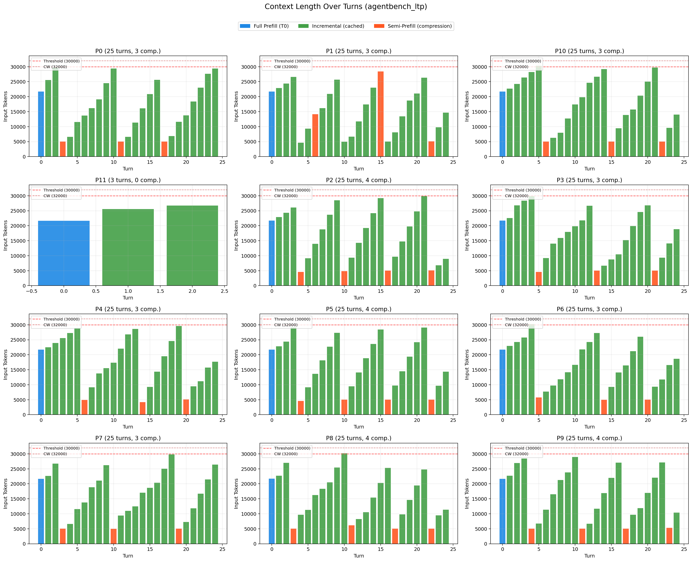

**特征**：图中蓝色为首轮 Full Prefill，绿色为 Prefix Cache 命中的增量轮，橙色为压缩后的 Semi-Prefill 轮。多轮 agentic request 平均跨越 **23.17 rounds**，平均累计上下文为 **440.4K tokens**，是单轮请求的 **3.6×–23.0×**。

### 2.4 Context Churn Ratio

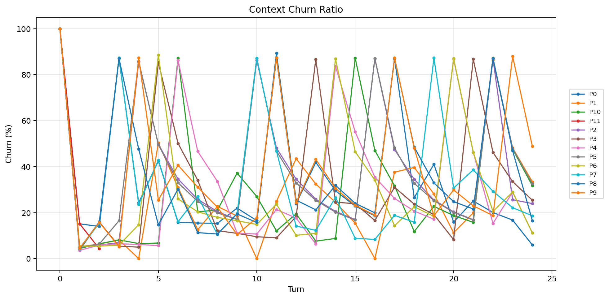

增量轮 churn 由新增 token 占当前上下文比例估计；压缩轮 churn 由 $(B_2+C_1)/L_{post}$ 估计。压缩轮通常出现明显尖峰，因为 B₂ 重写导致 C₁ 也需要重新 prefill。

---

## 3 Semi-Prefill 触发统计

### 3.1 每次压缩的 token 段分布

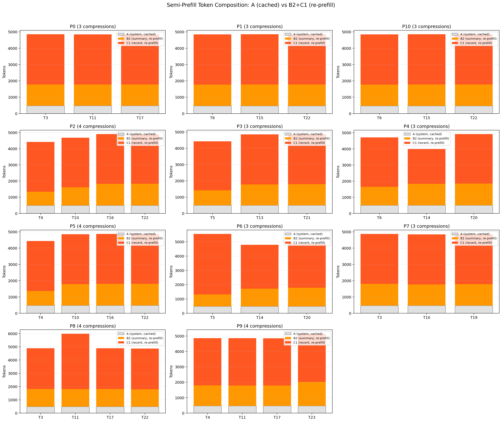

| 样本 | 事件 | Turn | A | B2 | C1 | B2+C1 | Async SP ms | Sync event ms |
| --- | --- | --- | --- | --- | --- | --- | --- | --- |
| P0 | 1 | 3 | 479 | 1,300 | 3,074 | 4,374 | 676 | 20,792 |
| P0 | 2 | 11 | 479 | 1,298 | 3,074 | 4,372 | 676 | 20,807 |
| P0 | 3 | 17 | 479 | 1,304 | 3,074 | 4,378 | 677 | 20,324 |
| P1 | 1 | 6 | 472 | 1,302 | 3,074 | 4,376 | 676 | 20,857 |
| P1 | 2 | 15 | 472 | 1,310 | 3,074 | 4,384 | 678 | 20,935 |
| P1 | 3 | 22 | 472 | 1,308 | 3,074 | 4,382 | 677 | 20,930 |
| P10 | 1 | 6 | 472 | 1,302 | 3,074 | 4,376 | 676 | 20,857 |
| P10 | 2 | 15 | 472 | 1,310 | 3,074 | 4,384 | 678 | 20,935 |
| P10 | 3 | 22 | 472 | 1,308 | 3,074 | 4,382 | 677 | 20,930 |
| P2 | 1 | 4 | 494 | 850 | 3,074 | 3,924 | 609 | 14,882 |
| P2 | 2 | 10 | 494 | 1,114 | 3,074 | 4,188 | 648 | 18,446 |
| P2 | 3 | 16 | 494 | 1,332 | 3,074 | 4,406 | 681 | 21,218 |
| P2 | 4 | 22 | 494 | 1,337 | 3,074 | 4,411 | 682 | 21,279 |
| P3 | 1 | 5 | 498 | 912 | 3,014 | 3,926 | 609 | 15,681 |
| P3 | 2 | 13 | 498 | 1,275 | 3,074 | 4,349 | 672 | 20,179 |
| P3 | 3 | 21 | 498 | 1,298 | 3,074 | 4,372 | 676 | 20,410 |
| P4 | 1 | 6 | 504 | 1,135 | 3,074 | 4,209 | 651 | 18,687 |
| P4 | 2 | 14 | 504 | 1,330 | 2,155 | 3,485 | 543 | 20,644 |
| P4 | 3 | 20 | 504 | 1,343 | 3,074 | 4,417 | 683 | 21,350 |
| P5 | 1 | 4 | 481 | 883 | 3,074 | 3,957 | 614 | 15,738 |
| P5 | 2 | 10 | 481 | 1,301 | 3,074 | 4,375 | 676 | 20,516 |
| P5 | 3 | 16 | 481 | 1,320 | 3,074 | 4,394 | 679 | 20,932 |
| P5 | 4 | 22 | 481 | 1,319 | 3,074 | 4,393 | 679 | 21,022 |
| P6 | 1 | 5 | 479 | 834 | 4,243 | 5,077 | 782 | 14,740 |
| P6 | 2 | 14 | 479 | 1,237 | 3,074 | 4,311 | 667 | 19,832 |
| P6 | 3 | 20 | 479 | 1,302 | 3,074 | 4,376 | 676 | 20,359 |
| P7 | 1 | 3 | 471 | 1,331 | 3,074 | 4,405 | 681 | 20,723 |
| P7 | 2 | 10 | 471 | 1,297 | 3,074 | 4,371 | 676 | 20,379 |
| P7 | 3 | 19 | 471 | 1,317 | 3,074 | 4,391 | 679 | 21,039 |
| P8 | 1 | 3 | 484 | 1,329 | 3,074 | 4,403 | 680 | 20,766 |
| P8 | 2 | 11 | 484 | 1,322 | 4,181 | 5,503 | 845 | 20,671 |
| P8 | 3 | 17 | 484 | 1,328 | 3,074 | 4,402 | 680 | 20,587 |
| P8 | 4 | 22 | 484 | 1,312 | 3,074 | 4,386 | 678 | 20,399 |
| P9 | 1 | 4 | 468 | 1,330 | 3,074 | 4,404 | 681 | 20,977 |
| P9 | 2 | 11 | 468 | 1,323 | 3,074 | 4,397 | 680 | 21,043 |
| P9 | 3 | 17 | 468 | 1,318 | 3,074 | 4,392 | 679 | 20,800 |
| P9 | 4 | 23 | 468 | 1,560 | 3,126 | 4,686 | 723 | 23,409 |

**统计汇总**：

| 指标 | 值 |
|------|-----|
| B₂+C₁ 均值 | 4,371 tokens |
| B₂+C₁ 范围 | 3,485 – 5,503 tokens |
| C₁ 均值 | 3,110 tokens |
| B₂ 均值 | 1,260 tokens |
| Semi-prefill 均值 | 676 ms/event |
| Sync 单事件均值 | 20,110 ms/event |

### 3.2 Semi-Prefill 尖峰 vs 增量基线

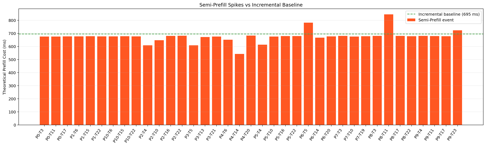

Async 下每次压缩事件的 semi-prefill 平均为 **676 ms**，约为普通增量 prefill 基线的 **1.0×**。

---

## 4 执行时间分解（Prefix Caching 理论模型）

### 4.1 公式

| 轮类型 | Prefill 成本 | Decode 成本 | 备注 |
|--------|-------------|-------------|------|
| T0（Full Prefill） | $L_0 \times r_{pf} + c_{fix}$ | $O \times r_{dec}$ | 冷启动 |
| 增量轮（Cached） | $\delta \times r_{pf} + c_{fix}$ | $O \times r_{dec}$ | Prefix Cache 命中 |
| 压缩轮（Async） | $(B_2 + C_1) \times r_{pf} + c_{fix}$ | $O \times r_{dec}$ | 仅 Semi-Prefill |
| 压缩轮（Sync） | $B_1 \times r_{pf} + B_2 \times r_{dec} + (B_2+C_1) \times r_{pf} + c_{fix}$ | $O \times r_{dec}$ | 含摘要生成 |

### 4.2 总时间分解

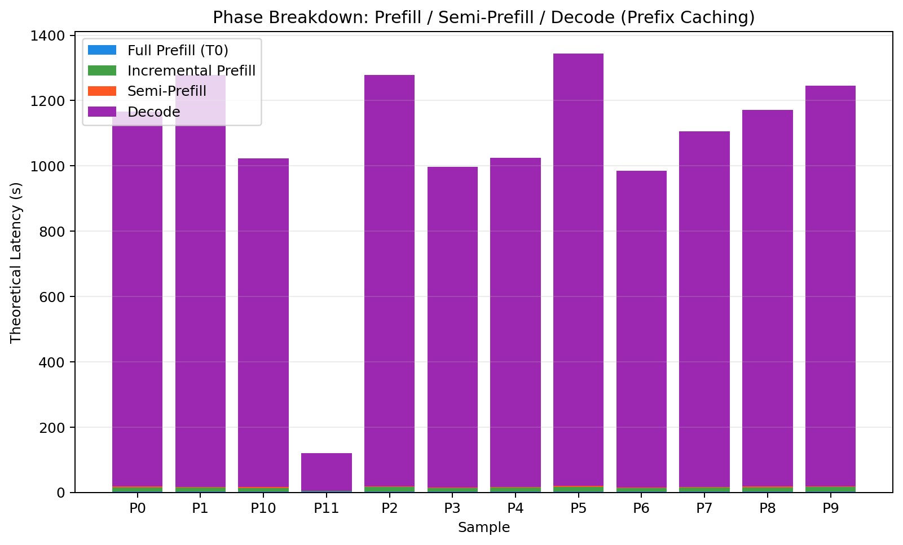

| 样本 | Async s | Sync s | Full ms | Incr ms | SP ms | Decode ms | SumDec ms | Sync overhead |
| --- | --- | --- | --- | --- | --- | --- | --- | --- |
| P0 | 1,165.57 | 1,225.46 | 3,274 | 12,024 | 2,029 | 1,148,244 | 46,824 | 5.3% |
| P1 | 1,278.24 | 1,338.93 | 3,272 | 10,928 | 2,031 | 1,262,004 | 47,040 | 4.9% |
| P10 | 1,023.04 | 1,083.73 | 3,272 | 10,396 | 2,031 | 1,007,340 | 47,040 | 6.1% |
| P11 | 120.21 | 120.21 | 3,272 | 794 | 0 | 116,148 | 0 | 0.0% |
| P2 | 1,278.92 | 1,352.12 | 3,276 | 12,589 | 2,619 | 1,260,432 | 55,596 | 5.9% |
| P3 | 996.68 | 1,051.00 | 3,276 | 10,284 | 1,957 | 981,168 | 41,820 | 5.7% |
| P4 | 1,025.17 | 1,083.98 | 3,277 | 10,760 | 1,877 | 1,009,260 | 45,696 | 5.9% |
| P5 | 1,344.83 | 1,420.39 | 3,274 | 13,437 | 2,648 | 1,325,472 | 57,876 | 5.8% |
| P6 | 985.15 | 1,037.95 | 3,274 | 10,123 | 2,125 | 969,624 | 40,476 | 5.6% |
| P7 | 1,106.39 | 1,166.49 | 3,272 | 11,276 | 2,035 | 1,089,804 | 47,340 | 5.6% |
| P8 | 1,171.45 | 1,250.99 | 3,274 | 11,746 | 2,884 | 1,153,548 | 63,492 | 7.1% |
| P9 | 1,246.08 | 1,329.55 | 3,272 | 12,377 | 2,762 | 1,227,672 | 66,372 | 6.9% |

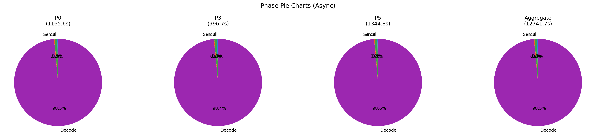

### 4.3 Async vs Sync 对比

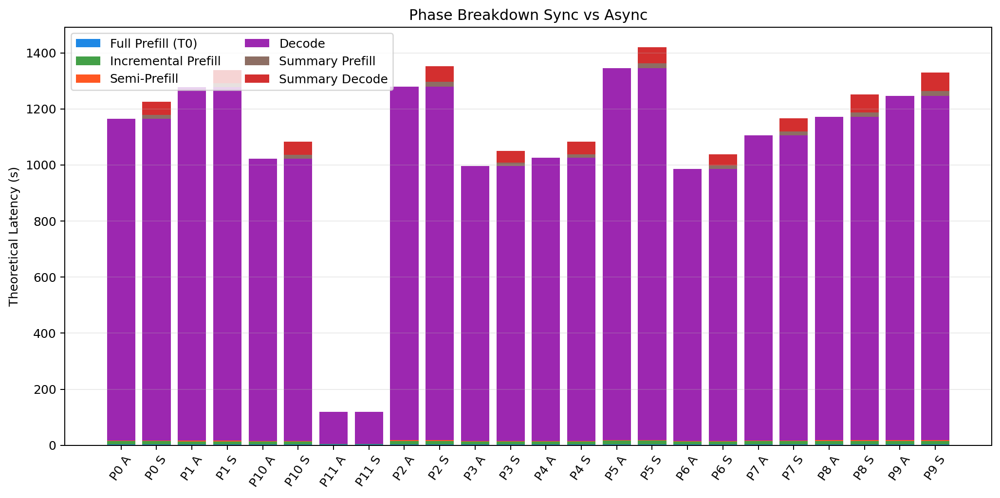

同步摘要使理论总延迟从 **12,741.7s** 增加到 **13,460.8s**，增幅 **5.6%**。新增成本主要来自 Summary Decode。

### 4.4 Prefill-Only 分解（排除 Decode）

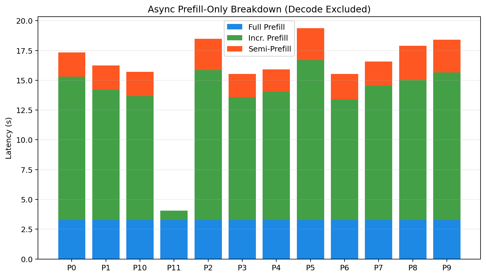

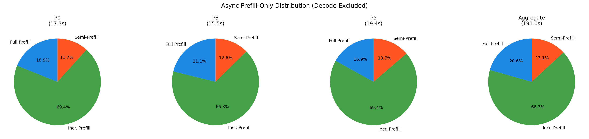

**关键发现（Async）**：Semi-Prefill 只发生在 **13.3%** 的 rounds，却消耗了 **13.1%** 的 Prefill-only 计算量；Incremental Prefill 占 **66.3%**。

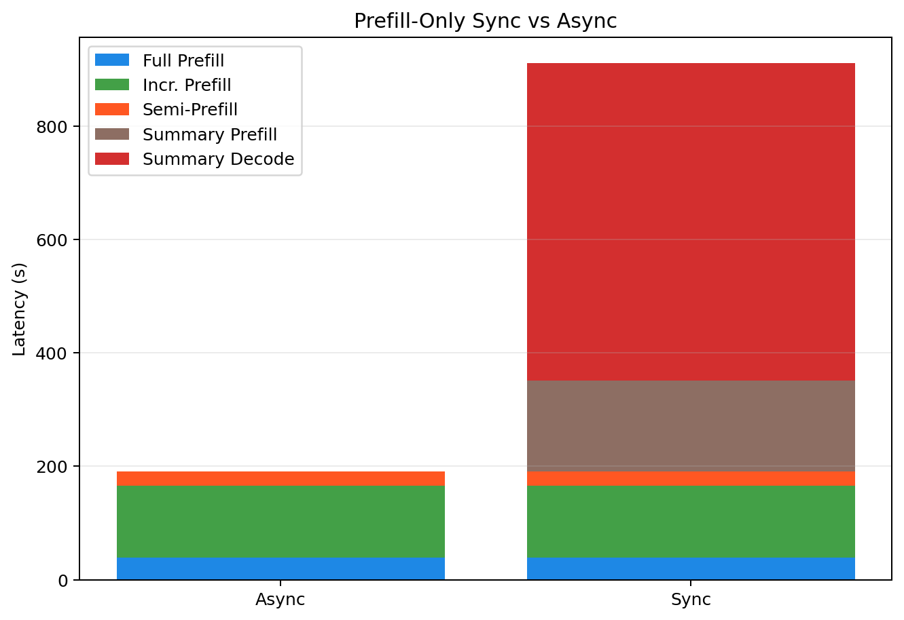

Sync 下 Prefill-only 总量从 **191.0s** 增至 **910.1s**，倍率 **4.8×**，其中 Summary Decode 占 Sync Prefill-only 的 **61.5%**。

### 4.5 Per-Turn Latency Breakdown

前 3 个有效样本的逐轮图如下，文件命名与参考报告保持一致：

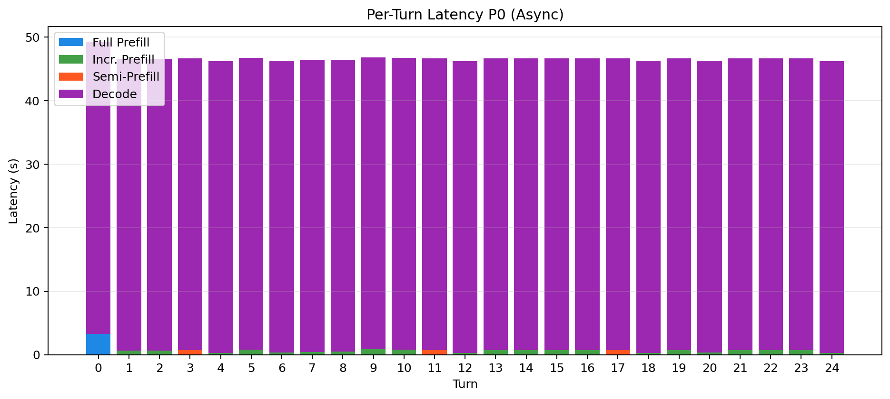
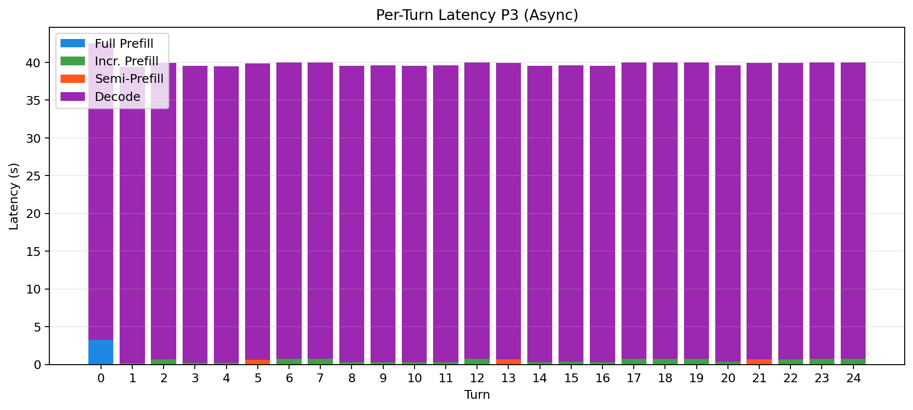
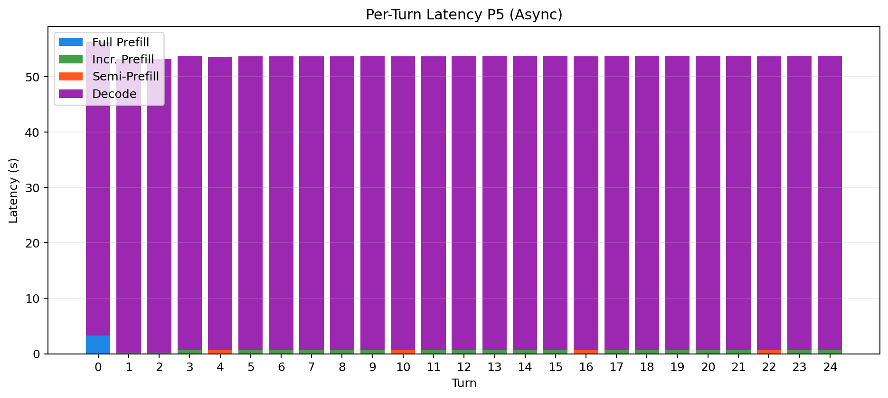

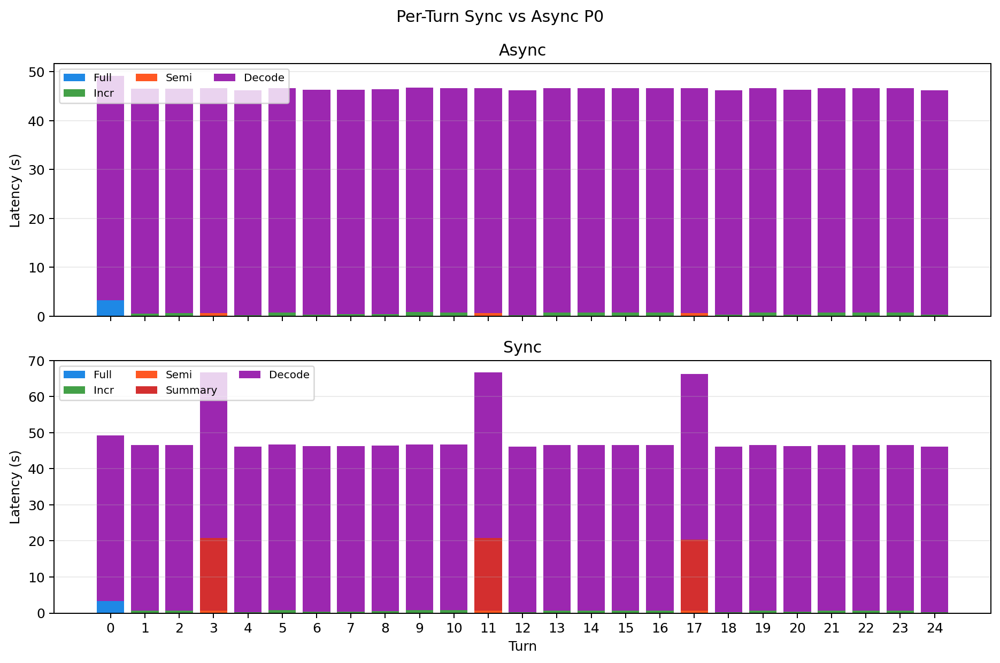
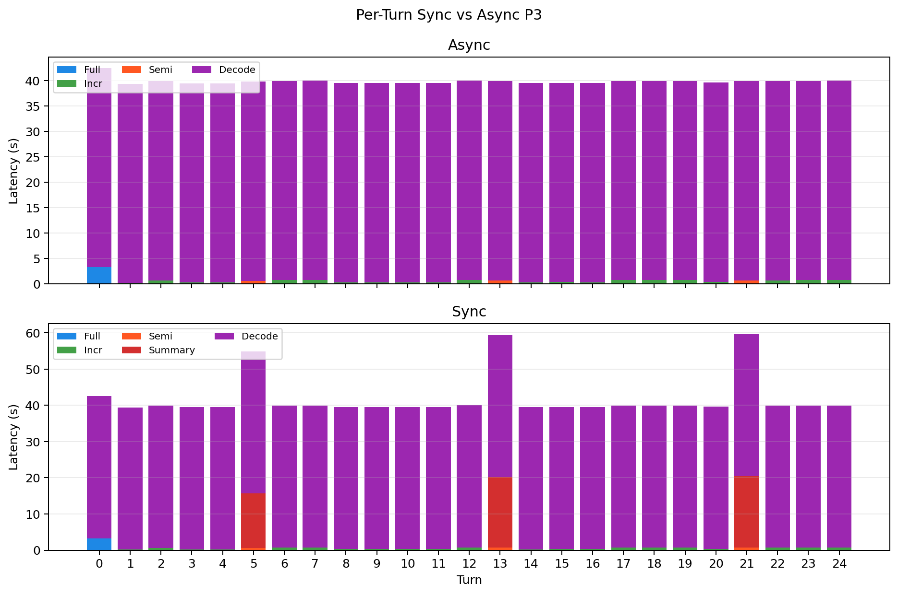
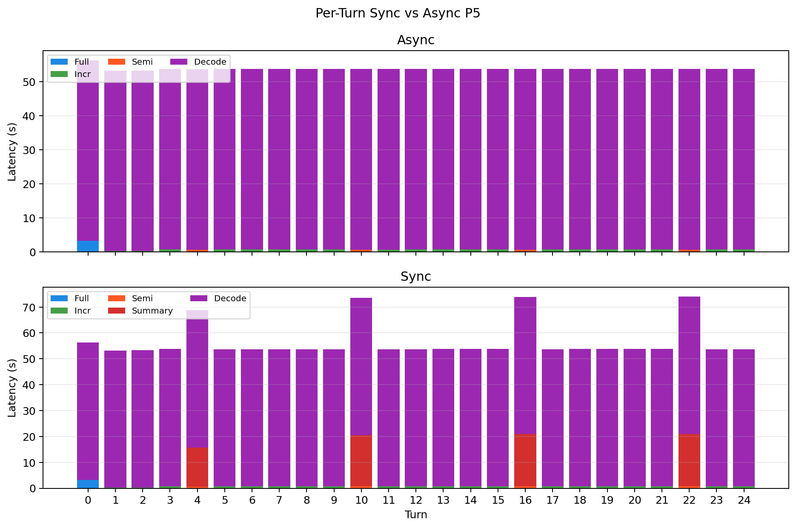

---

## 5 同步 vs 异步摘要：时间占比对比

### 5.1 摘要生成的成本分解

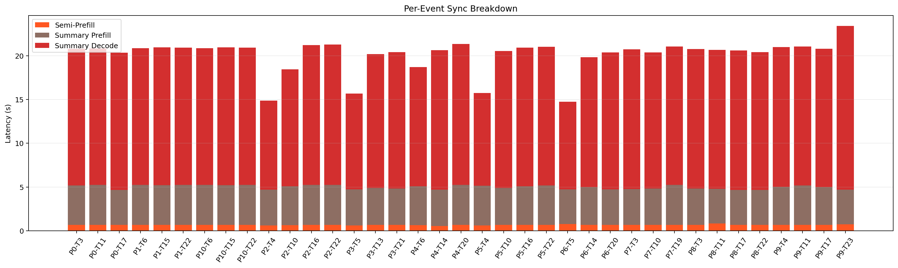

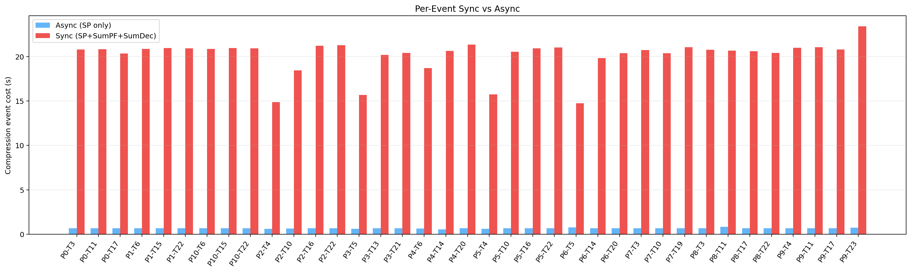

Async 下单次压缩事件平均只承担 **0.68s** 的 Semi-Prefill；Sync 下平均膨胀至 **20.11s**。

### 5.2 总延迟与占比

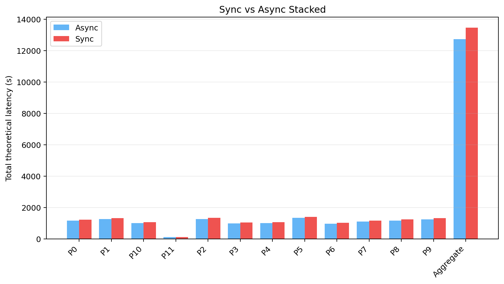

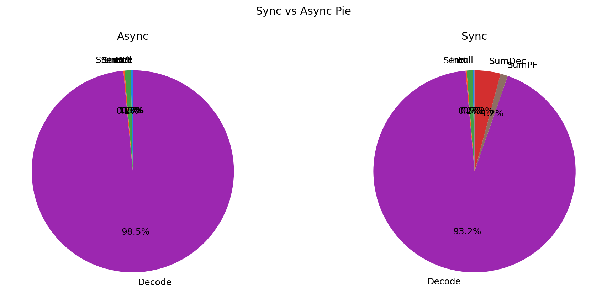

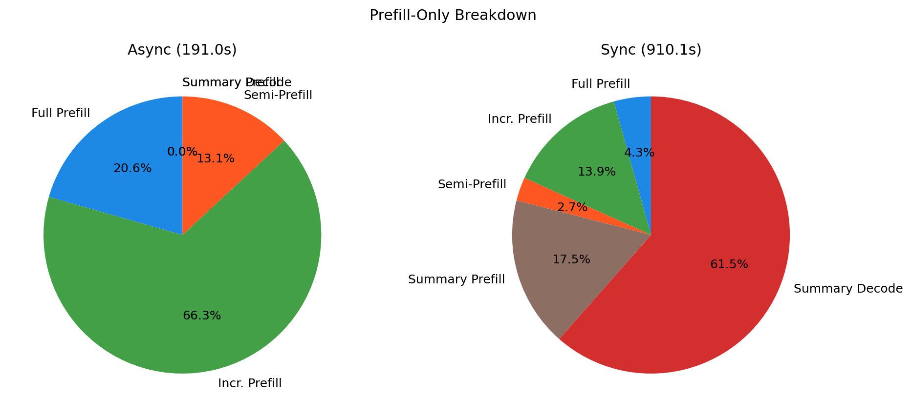

### 5.3 Overhead 对比

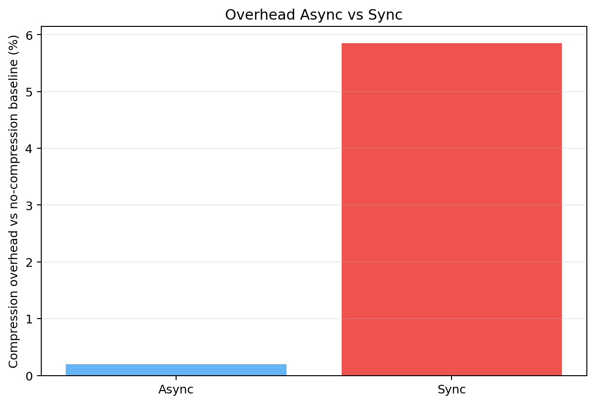

| 场景 | 压缩 Overhead |
|------|-------------|
| Async | **0.20%** |
| Sync | **5.85%** |

---

## 6 核心结论

| 结论 | 数据支撑 |
|------|----------|
| 单个 agentic request 平均触发 3.08 次压缩 | 37 events / 12 active samples |
| 平均跨越 23.17 rounds | timing/summary 统计 |
| 平均累计上下文 440.4K tokens | sum(prompt_tokens) |
| 累计上下文是单轮的 3.6×–23.0× | accumulated / first prompt |
| Async 压缩 overhead 为 0.20% | 仅 Semi-Prefill 进关键路径 |
| Sync 压缩 overhead 为 5.85% | Summary Decode 进入关键路径 |

## 附录

- 生成脚本：`code/generate_cw8000_reference_analysis.py`
- JSON 结果：`analysis_results.json`
- 表格目录：`tables/`
- 图表目录：`charts/`
