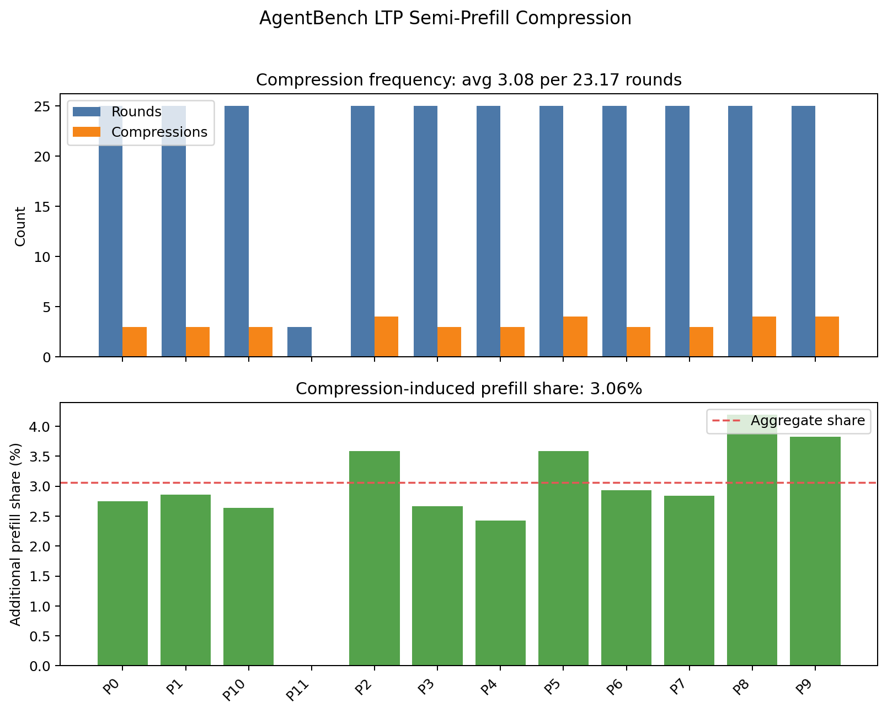
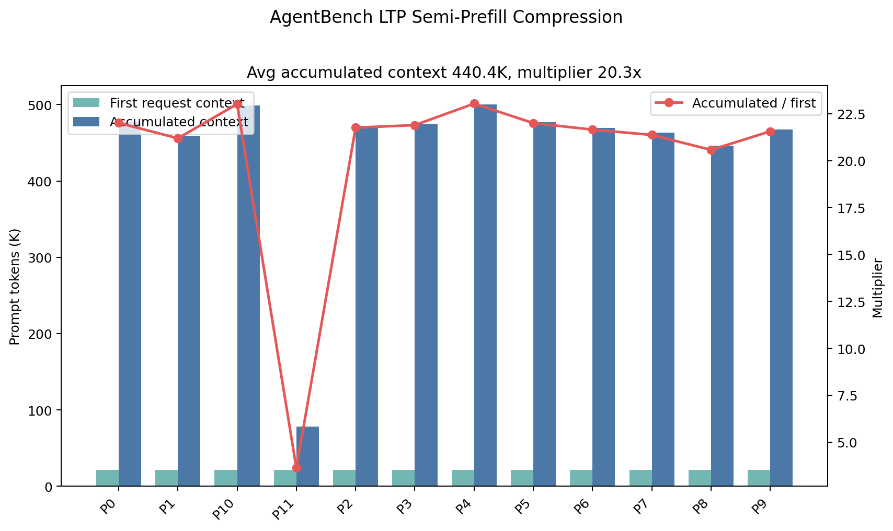
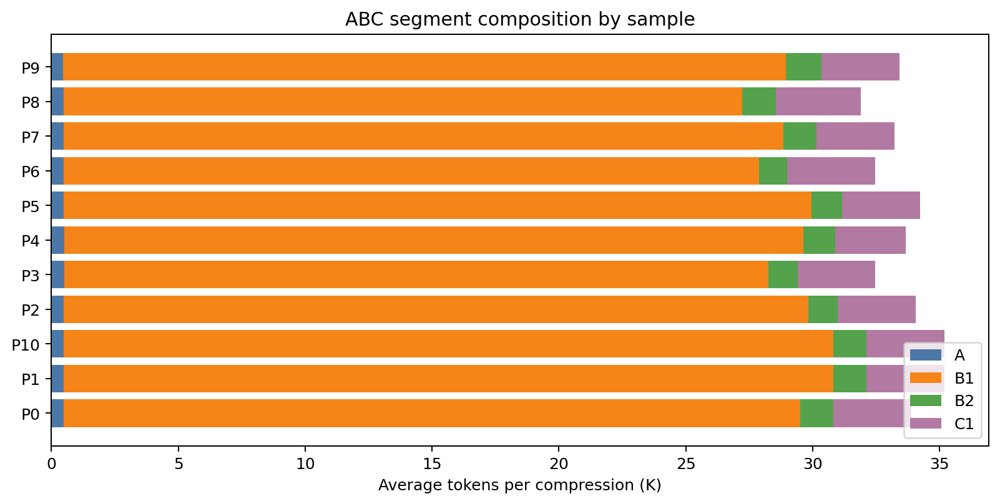
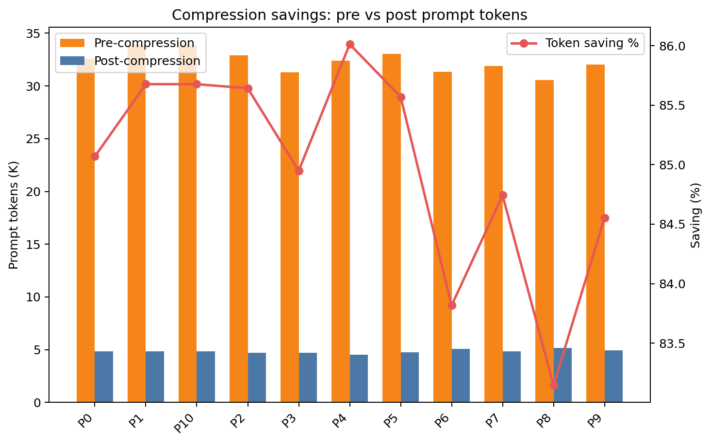
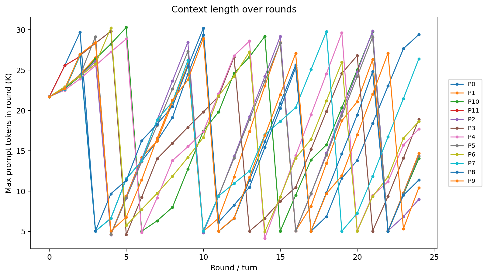
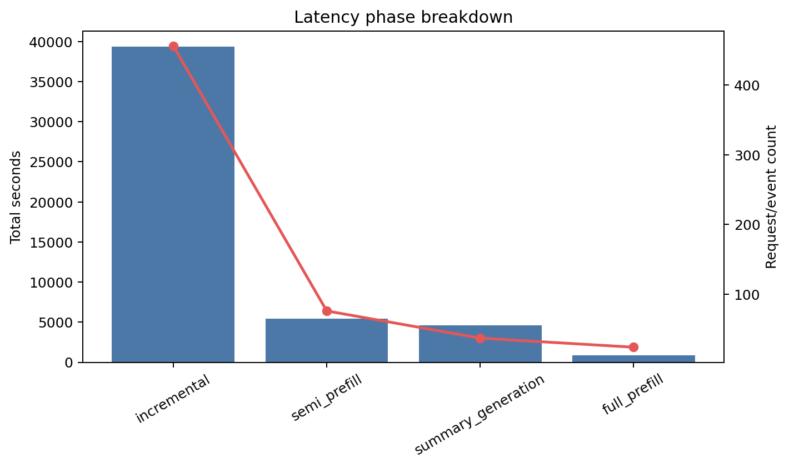

# AgentBench LTP Semi-Prefill Compression 分析报告

生成时间：20260507

## 结论摘要

- 可读样本数：12；有效 timing 样本数：12；压缩事件数：37；总 rounds：278；总 LLM calls：556。
- 平均每个 agentic request 运行 23.17 rounds / 46.33 LLM calls，并触发 3.08 次压缩。
- 压缩引入的额外 prefill tokens 为 161,718，占累计 prompt/context tokens 的 3.06%。
- 单请求平均累计上下文为 440,442 tokens；相比首轮单次请求，平均为 20.30x，样本范围为 3.6x-23.0x。

既有 results/analysis 不会被覆盖；本报告重新扫描 compressed 目录中的全部可读 puzzle 文件。

## 数据口径

- `rounds` 优先采用 run summary 中的 turns/decoded_turns；没有 summary 时使用 timing 日志中的唯一 turn 数。
- `LLM calls` 来自 `timing/*.json` 记录条数。
- 每请求均值只使用 `steps>0` 且首轮 `prompt_tokens>0` 的有效 timing 样本；空样本仍保留在完整性统计和样本表中。
- `accumulated context` 定义为单个样本所有 LLM request 的 `prompt_tokens` 之和。
- `single-round inference` 对照定义为该样本第一条 timing 记录的 `prompt_tokens`。
- `additional prefill tokens due to compression` 优先采用 timing 的 `semi_prefill_tokens`；若没有该字段，则采用 ABC 压缩事件中的 `B2+C1`。
- 本报告不读取或输出长 prompt 原文，只保留 timing/ABC 的标量统计字段。

## 数据完整性

| 项目 | 数量 |
| --- | ---: |
| timing files | 12 |
| ABC files | 12 |
| trace files | 12 |
| prompt log files | 12 |
| checkpoint files | 1 |
| declared sample ids | - |

## Figure 1：压缩频率与额外 Prefill 占比

As shown in Figure 1, a single agentic request invokes 3.08 compressions per 23.17 rounds on average, while the additional prefill tokens due to compression account for 3.06% of accumulated prompt tokens.

中文解读：图 1 同时展示每个样本的 rounds、压缩次数和压缩导致的额外 prefill 占比。整体压缩频率为 0.13 次/round，这对应压缩触发概率 P 的经验估计。

## Figure 2：多轮累计上下文与单轮对照

As shown in Figure 2, a single agentic request often spans 23.17 rounds and accumulates a total of 440.4K context tokens, which is 3.6x-23.0x longer than single-round inference.

中文解读：图 2 展示首轮上下文、累计上下文以及累计/首轮倍数。该图说明 agentic request 的成本不能只按单轮推理估计；多轮调用会重复携带或重建大量上下文。

## 样本工作负载表

| 样本 | run | rounds | LLM calls | compressions | P | first ctx | max ctx | acc ctx | acc/first | extra prefill |
| --- | --- | --- | --- | --- | --- | --- | --- | --- | --- | --- |
| P0 | compressed | 25 | 50 | 3 | 0.12 | 21,690 | 29,706 | 477,302 | 22.01 | 2.75% |
| P1 | compressed | 25 | 50 | 3 | 0.12 | 21,681 | 28,440 | 459,366 | 21.19 | 2.86% |
| P10 | compressed | 25 | 50 | 3 | 0.12 | 21,683 | 30,294 | 498,957 | 23.01 | 2.63% |
| P11 | compressed | 3 | 6 | 0 | 0.00 | 21,678 | 26,703 | 78,534 | 3.62 | 0.00% |
| P2 | compressed | 25 | 50 | 4 | 0.16 | 21,705 | 29,838 | 472,201 | 21.76 | 3.59% |
| P3 | compressed | 25 | 50 | 3 | 0.12 | 21,709 | 29,820 | 475,188 | 21.89 | 2.66% |
| P4 | compressed | 25 | 50 | 3 | 0.12 | 21,715 | 29,626 | 500,191 | 23.03 | 2.42% |
| P5 | compressed | 25 | 50 | 4 | 0.16 | 21,692 | 29,158 | 477,128 | 22.00 | 3.59% |
| P6 | compressed | 25 | 50 | 3 | 0.12 | 21,690 | 30,220 | 469,565 | 21.65 | 2.93% |
| P7 | compressed | 25 | 50 | 3 | 0.12 | 21,682 | 29,778 | 463,284 | 21.37 | 2.84% |
| P8 | compressed | 25 | 50 | 4 | 0.16 | 21,695 | 30,176 | 446,226 | 20.57 | 4.19% |
| P9 | compressed | 25 | 50 | 4 | 0.16 | 21,679 | 28,925 | 467,365 | 21.56 | 3.83% |

## 压缩事件表

| 样本 | idx | turn | step | pre | post | B1 | B2 | C1 | B2+C1 | saving | summary s |
| --- | --- | --- | --- | --- | --- | --- | --- | --- | --- | --- | --- |
| P0 | 1 | 3 | 0 | 33,659 | 4,853 | 30,106 | 1,300 | 3,074 | 4,374 | 85.58% | 145.7 |
| P0 | 2 | 11 | 0 | 33,922 | 4,851 | 30,368 | 1,298 | 3,074 | 4,372 | 85.70% | 284.4 |
| P0 | 3 | 17 | 0 | 30,216 | 4,857 | 26,663 | 1,304 | 3,074 | 4,378 | 83.93% | 232.4 |
| P1 | 1 | 6 | 0 | 33,922 | 4,848 | 30,375 | 1,302 | 3,074 | 4,376 | 85.71% | 83.5 |
| P1 | 2 | 15 | 0 | 33,797 | 4,856 | 30,251 | 1,310 | 3,074 | 4,384 | 85.63% | 133.9 |
| P1 | 3 | 22 | 0 | 33,922 | 4,854 | 30,375 | 1,308 | 3,074 | 4,382 | 85.69% | 133.1 |
| P10 | 1 | 6 | 0 | 33,922 | 4,848 | 30,375 | 1,302 | 3,074 | 4,376 | 85.71% | 83.5 |
| P10 | 2 | 15 | 0 | 33,797 | 4,856 | 30,251 | 1,310 | 3,074 | 4,384 | 85.63% | 133.9 |
| P10 | 3 | 22 | 0 | 33,922 | 4,854 | 30,375 | 1,308 | 3,074 | 4,382 | 85.69% | 133.1 |
| P2 | 1 | 4 | 0 | 30,722 | 4,418 | 27,154 | 850 | 3,074 | 3,924 | 85.62% | 117.1 |
| P2 | 2 | 10 | 0 | 33,102 | 4,682 | 29,534 | 1,114 | 3,074 | 4,188 | 85.86% | 292.3 |
| P2 | 3 | 16 | 0 | 33,922 | 4,900 | 30,353 | 1,332 | 3,074 | 4,406 | 85.56% | 299.0 |
| P2 | 4 | 22 | 0 | 33,922 | 4,905 | 30,353 | 1,337 | 3,074 | 4,411 | 85.54% | 134.3 |
| P3 | 1 | 5 | 0 | 31,030 | 4,424 | 27,518 | 912 | 3,014 | 3,926 | 85.74% | 44.6 |
| P3 | 2 | 13 | 0 | 31,615 | 4,847 | 28,043 | 1,275 | 3,074 | 4,349 | 84.67% | 89.5 |
| P3 | 3 | 21 | 0 | 31,292 | 4,870 | 27,720 | 1,298 | 3,074 | 4,372 | 84.44% | 133.6 |
| P4 | 1 | 6 | 0 | 33,015 | 4,713 | 29,437 | 1,135 | 3,074 | 4,209 | 85.72% | 62.8 |
| P4 | 2 | 14 | 0 | 30,267 | 3,989 | 27,608 | 1,330 | 2,155 | 3,485 | 86.82% | 99.9 |
| P4 | 3 | 20 | 0 | 33,922 | 4,921 | 30,343 | 1,343 | 3,074 | 4,417 | 85.49% | 187.4 |
| P5 | 1 | 4 | 0 | 33,745 | 4,438 | 30,190 | 883 | 3,074 | 3,957 | 86.85% | 48.1 |
| P5 | 2 | 10 | 0 | 31,742 | 4,856 | 28,187 | 1,301 | 3,074 | 4,375 | 84.70% | 86.5 |
| P5 | 3 | 16 | 0 | 32,972 | 4,875 | 29,417 | 1,320 | 3,074 | 4,394 | 85.21% | 132.6 |
| P5 | 4 | 22 | 0 | 33,654 | 4,874 | 30,099 | 1,319 | 3,074 | 4,393 | 85.52% | 132.8 |
| P6 | 1 | 5 | 0 | 31,060 | 5,556 | 26,338 | 834 | 4,243 | 5,077 | 82.11% | 41.3 |
| P6 | 2 | 14 | 0 | 32,361 | 4,790 | 28,808 | 1,237 | 3,074 | 4,311 | 85.20% | 111.1 |
| P6 | 3 | 20 | 0 | 30,612 | 4,855 | 27,059 | 1,302 | 3,074 | 4,376 | 84.14% | 131.6 |
| P7 | 1 | 3 | 0 | 30,683 | 4,876 | 27,138 | 1,331 | 3,074 | 4,405 | 84.11% | 59.8 |
| P7 | 2 | 10 | 0 | 31,143 | 4,842 | 27,598 | 1,297 | 3,074 | 4,371 | 84.45% | 87.3 |
| P7 | 3 | 19 | 0 | 33,922 | 4,862 | 30,376 | 1,317 | 3,074 | 4,391 | 85.67% | 102.7 |
| P8 | 1 | 3 | 0 | 31,144 | 4,887 | 27,586 | 1,329 | 3,074 | 4,403 | 84.31% | 97.0 |
| P8 | 2 | 11 | 0 | 31,074 | 5,987 | 26,409 | 1,322 | 4,181 | 5,503 | 80.73% | 100.7 |
| P8 | 3 | 17 | 0 | 30,029 | 4,886 | 26,471 | 1,328 | 3,074 | 4,402 | 83.73% | 100.8 |
| P8 | 4 | 22 | 0 | 30,075 | 4,870 | 26,517 | 1,312 | 3,074 | 4,386 | 83.81% | 100.5 |
| P9 | 1 | 4 | 0 | 32,450 | 4,872 | 28,908 | 1,330 | 3,074 | 4,404 | 84.99% | 78.2 |
| P9 | 2 | 11 | 0 | 33,459 | 4,865 | 29,917 | 1,323 | 3,074 | 4,397 | 85.46% | 132.8 |
| P9 | 3 | 17 | 0 | 32,244 | 4,860 | 28,702 | 1,318 | 3,074 | 4,392 | 84.93% | 101.7 |
| P9 | 4 | 23 | 0 | 30,035 | 5,154 | 26,440 | 1,560 | 3,126 | 4,686 | 82.84% | 107.1 |

ABC 分段图如下：

压缩前后 prompt token 对比如下：

## Context 长度随轮次变化

这张图采用每个 round 内最大的 `prompt_tokens` 作为该 round 的上下文长度。如果 run_config 中存在 threshold，图中会画出阈值线。

## Timing / Phase Breakdown

| phase | count | prompt tokens | output tokens | total s |
| --- | --- | --- | --- | --- |
| full_prefill | 24 | 275,644 | 17,920 | 898.6 |
| incremental | 456 | 4,744,442 | 893,093 | 39,363.0 |
| semi_prefill | 76 | 265,221 | 134,880 | 5,459.7 |
| summary_generation | 37 | 0 | 0 | 4,576.7 |

## 配置摘要

_未发现 run_config.json；本节仅基于 timing/ABC 文件统计。_

## Score / Validity 摘要

_未发现 score summary 或 benchmark validity 字段；本文不报告 accuracy 结论。_

## 证据与限制

已验证：

- timing、ABC、trace/prompt log/checkpoint 文件数量已经按文件系统重新扫描。
- 所有核心数值都写入 `analysis_results.json` 与 `tables/*.csv`，报告中的 Figure 1/2 文案由同一份 JSON 指标生成。
- 图表均来自 timing 和 ABC 的标量字段，不依赖 README 或旧报告文字。

未验证：

- 本分析不是一次新的 benchmark run，也不证明未完成样本可以跑满目标 turns。
- BFCL validity/score 若为 invalid，仅说明这些样本不能作为最终准确率结论；压缩次数、上下文长度和 prefill token 统计仍可作为运行日志证据。
- `additional prefill tokens` 是按日志可见的 semi-prefill 或 ABC `B2+C1` 估算；如果底层推理服务还有隐藏 prefix-cache 命中/失效，该比例不包含未记录的内部实现细节。

## 产物清单

- `analysis_results.json`：完整结构化统计。
- `tables/sample_workload.csv`：样本级工作负载表。
- `tables/compression_events.csv`：压缩事件表。
- `tables/phase_breakdown.csv`：阶段耗时与 token 表。
- `charts/*.png`：报告图表。
- `code/generate_analysis.py`：生成本目录产物的脚本副本。
