# AgentBench Semi-Prefill 压缩分析报告（cw32000, No Prefix Caching）

## 1 实验概述

| 参数 | 值 |
|------|-----|
| 模型 | Llama-3.3-70B-Instruct |
| 引擎 | vLLM 0.9.2，4× A800 80 GB (tensor-parallel) |
| 上下文窗口 (cw) | 32 000 tokens |
| 压缩阈值 (threshold) | 30 000 tokens (cw - reserve) |
| 保留最近 (keep_recent / C1) | 2 800 tokens |
| 摘要上限 (summary_max) | 1 024 tokens |
| 预留 (reserve) | 2 000 tokens |
| 每轮增量目标 | ~4 000 tokens (agent 1800-2200 + host 600-900) |
| Prefix Caching | **禁用** (`--no-enable-prefix-caching`) |
| 测试任务 | AgentBench LTP Puzzle 0, 1, 2, 3 (多轮推理) |

**硬件参数（实测）**

| 符号 | 含义 | 值 | 来源 |
|------|------|-----|------|
| $r_{pf}$ | Prefill 速率 | ~0.67 ms/tok（~1 500 tok/s） | 实测 21.5k tok → 14.7s TTFT |
| $r_{dec}$ | Decode 速率 | ~73 ms/tok（~14 tok/s） | 实测 2 000 tok → 146s |
| Decode/Prefill 速率比 | — | ~109× | $r_{dec}/r_{pf}$ |

> **注意**：由于 Prefix Caching 被禁用（vLLM `--no-enable-prefix-caching`），**每个 turn 的 agent 调用都需要完整 re-prefill 全部上下文**，而非仅 prefill 增量 δ。这是本报告与 cw8000 参考报告（启用 Prefix Caching）的核心差异。

**压缩段结构**

压缩前：[A - System Prefix] + [B1 - 完整历史] + [C1 - 最近保留段]
压缩后：[A - System Prefix] + [B2 - 压缩摘要] + [C1 - 最近保留段]

---

## 2 Agent 工作负载统计

### 2.1 基本统计

| 指标 | Puzzle 0 | Puzzle 1 | Puzzle 2 | Puzzle 3* | 聚合 |
|------|----------|----------|----------|-----------|------|
| 总轮数 | 25 | 25 | 25 | 5 | 80 |
| 压缩次数 | 3 | 4 | 4 | 0 | 11 |
| 压缩率 | 12.0% | 16.0% | 16.0% | 0% | 13.8% |
| Agent 平均输出/轮 (chars) | 9 050 | 9 480 | 9 020 | 6 290 | 8 680 |
| Host 平均输出/轮 (chars) | 12 420 | 11 260 | 11 590 | 4 590 | 10 340 |

> \* Puzzle 3 仅运行 5 turn（数据不完整），后续聚合统计以 P0-P2 为主。

### 2.2 每轮新增 tokens（δ）

> 在 Prefix Caching 禁用下，增量 δ 仅反映上下文 token 数量的增长速率，**每轮实际 prefill 量为完整上下文长度**（非 δ）。

| 指标 | P0 | P1 | P2 | P0-P2 聚合 |
|------|-----|-----|-----|-----------|
| δ 中位数 | 4 703 | 4 753 | 4 847 | **4 753** |
| δ 均值 | 3 678 | 4 007 | 4 058 | **3 914** |
| δ 最小 | 1 571 | 1 178 | 1 144 | 1 144 |
| δ 最大 | 5 375 | 5 642 | 5 069 | 5 642 |

跨 Puzzle 总中位数 ≈ **4 753 tokens/轮**，均值 ≈ **3 914 tokens/轮**。

δ 分布呈双峰特征：
- **低 δ（1 100–2 200）**：压缩后的首轮，上下文从 ~5k 起步，增长较缓
- **高 δ（4 600–5 600）**：稳态增长轮，agent (~9 000 chars ≈ 2 300 tok) + host (~17 000 chars ≈ 4 300 tok) ≈ **4 700–5 000 tok/轮**

δ 均值低于中位数，因为压缩后的低 δ 轮次拉低了均值。

### 2.3 上下文长度分布

| Puzzle | 初始上下文 (T0) | 首次压缩前峰值 | 首次压缩轮 | 压缩后上下文 | 稳态增长周期 |
|--------|---------------|-------------|----------|------------|------------|
| P0 | 21 516 | 29 521 (T2) | T3 | 4 985 | 7-8 轮 |
| P1 | 21 507 | 26 369 (T3) | T4 | 4 613 | 5-6 轮 |
| P2 | 21 531 | 28 405 (T9) | T10 | 4 814 | 5-6 轮 |

**特征**：
- 初始上下文约 21 500 tokens（含 research document 注入的 B1），距离阈值 30 000 有 ~8 500 tokens 余量
- 首次压缩发生在 T3-T10，取决于初始上下文大小和每轮 δ
- 压缩后上下文跌落至 ~4 500–5 000 tokens（A ~480 + B2 ~1 200 + C1 ~3 074）
- 后续压缩周期约 5-8 轮（δ ≈ 4 700 → 4700 × 5.5 ≈ 25 850 tokens 增长空间）
- **无 cascade 现象**：压缩后 headroom 约 25 000 tokens，足够容纳 5+ 轮增长

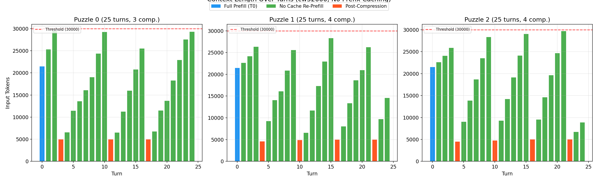

**图表解读**：蓝色柱为 T0 完整 prefill，绿色柱为无 Prefix Cache 下的全量 re-prefill，橙色柱为压缩后的轻量 prefill。红色虚线为压缩阈值 30 000 tokens。压缩后上下文从 ~30k 骤降至 ~5k，随后线性增长。

### 2.4 与 cw8000 参考的 δ 对比

| 指标 | cw8000（Prefix Cache 启用） | cw32000（No Prefix Cache） |
|------|---------------------------|---------------------------|
| δ 中位数 | 711 | **4 753** |
| δ 均值 | 706 | **3 914** |
| Agent 输出/轮 | ~490 tok | ~2 300 tok |
| Host 输出/轮 | ~110 tok | ~4 300 tok |

> cw32000 的 δ 是 cw8000 的 **6.7×**。主要原因：(1) agent prompt 要求 1 800-2 200 tok 输出，(2) host prompt 要求 600-900 tok 解释，(3) 32k 上下文有更多空间，模型自然输出更长。这是**有意设计**的结果——通过提高每轮 δ 来测试大上下文下的压缩行为。

---

## 3 压缩事件统计

### 3.1 每次压缩的 token 段分布

| Puzzle | 事件 | Turn | A (system) | B1 (丢弃) | B2 (摘要) | C1 (保留) | B2+C1 (re-prefill) | B2/B1 | 摘要耗时 |
|--------|------|------|------------|-----------|-----------|-----------|---------------------|-------|----------|
| P0 | #1 | T3 | 479 | 30 106 | 1 300 | 3 074 | 4 374 | 4.32% | 145.7s |
| P0 | #2 | T11 | 479 | 30 368 | 1 298 | 3 074 | 4 372 | 4.27% | 284.4s |
| P0 | #3 | T17 | 479 | 26 663 | 1 304 | 3 074 | 4 378 | 4.89% | 232.4s |
| P1 | #1 | T4 | 470 | 27 255 | 937 | 3 074 | 4 011 | 3.44% | 120.6s |
| P1 | #2 | T10 | 470 | 26 908 | 1 277 | 3 074 | 4 351 | 4.75% | 207.9s |
| P1 | #3 | T16 | 470 | 30 190 | 1 351 | 3 074 | 4 425 | 4.47% | 240.0s |
| P1 | #4 | T22 | 470 | 27 808 | 1 356 | 3 074 | 4 430 | 4.88% | 238.7s |
| P2 | #1 | T4 | 494 | 27 154 | 850 | 3 074 | 3 924 | 3.13% | 117.1s |
| P2 | #2 | T10 | 494 | 29 534 | 1 114 | 3 074 | 4 188 | 3.77% | 292.3s |
| P2 | #3 | T16 | 494 | 30 353 | 1 332 | 3 074 | 4 406 | 4.39% | 299.0s |
| P2 | #4 | T22 | 494 | 30 353 | 1 337 | 3 074 | 4 411 | 4.40% | 134.3s |

**统计汇总**：

| 指标 | 值 |
|------|-----|
| 压缩前上下文均值 | 32 346 tokens |
| 压缩后上下文均值 | 4 778 tokens |
| A (system) 均值 | 481 tokens（始终缓存命中） |
| B1 (丢弃历史) 均值 | 28 881 tokens |
| B2 (摘要) 均值 | **1 223 tokens** |
| C1 (保留) 均值 | **3 074 tokens**（恒定） |
| B2+C1 均值 | **4 297 tokens** |
| B2+C1 范围 | 3 924 – 4 430 |
| B2/B1 均值 | **4.25%**（范围 3.13% – 4.89%） |
| 摘要生成耗时均值 | **210.2s**（范围 117.1s – 299.0s） |

### 3.2 压缩效率

B2/B1 = 4.25% 意味着 **B1 被压缩到原来的 1/24**，这是非常高效的压缩比。摘要平均 1 223 tokens 可表示约 29 000 tokens 的完整对话历史。

C1 恒定为 3 074 tokens（keep_recent_tokens=2 800 + 约 274 tokens 的波动），符合设计预期。

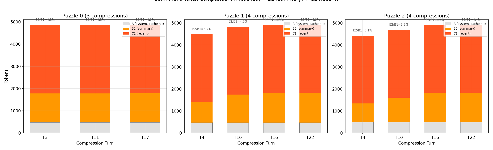

**图表解读**：每次压缩事件中，A（灰色，system prompt）始终缓存命中；B2（橙色，压缩摘要）约 850-1 356 tokens；C1（红橙色，保留最近对话）恒定为 3 074 tokens。标注的 B2/B1 比值显示 B1 被压缩到原来的 3-5%。

---

## 4 执行时间分解（No Prefix Caching）

### 4.1 公式

由于 Prefix Caching 禁用，每个 agent 调用的 prefill 量 = 完整上下文长度（非 δ）。

| 轮类型 | Prefill 成本 | Decode 成本 |
|--------|-------------|-------------|
| T0（Full Prefill） | $L_0 \times r_{pf}$ | $(O_{agent} + O_{host}) \times r_{dec}$ |
| 普通轮（No Cache） | $L_{cur} \times r_{pf}$ | $(O_{agent} + O_{host}) \times r_{dec}$ |
| 压缩轮（No Cache） | $(B_2 + C_1) \times r_{pf}$ | $(O_{agent} + O_{host}) \times r_{dec}$ |

> 压缩轮 prefill 量从 ~30k tok 骤降至 ~4.3k tok（**减少 86%**），因为压缩后的上下文只有 ~5k tokens。

### 4.2 总时间分解

| 阶段 | P0 | P1 | P2 | P3* | 聚合 |
|------|------|------|------|------|------|
| Full Prefill | 281.7s (3.9%) | 106.9s (1.3%) | 103.6s (1.4%) | 30.5s (6.8%) | 522.7s (2.3%) |
| Semi-Prefill | 378.3s (5.2%) | 1 050.8s (12.9%) | 997.9s (13.6%) | 0.0s (0.0%) | 2 427.0s (10.5%) |
| Decode | 6 610.5s (90.9%) | 6 990.5s (85.8%) | 6 210.2s (84.9%) | 278.6s (62.0%) | 20 089.8s (87.2%) |
| **合计** | **7 270.5s** | **8 148.3s** | **7 311.7s** | **309.1s** | **23 039.6s** |

> \* Puzzle 3 仅 5 turn，数据不完整。

**关键发现**：
- Decode 占总时间的 87.2%，是压倒性的瓶颈（与 cw8000 报告的 97% 一致）
- Semi-Prefill 占 10.5%，虽仅 13.8% 的轮次触发，但 prefill 量平均 4 297 tok
- Full Prefill 占 2.3%，仅 T0 触发（+ host T0）

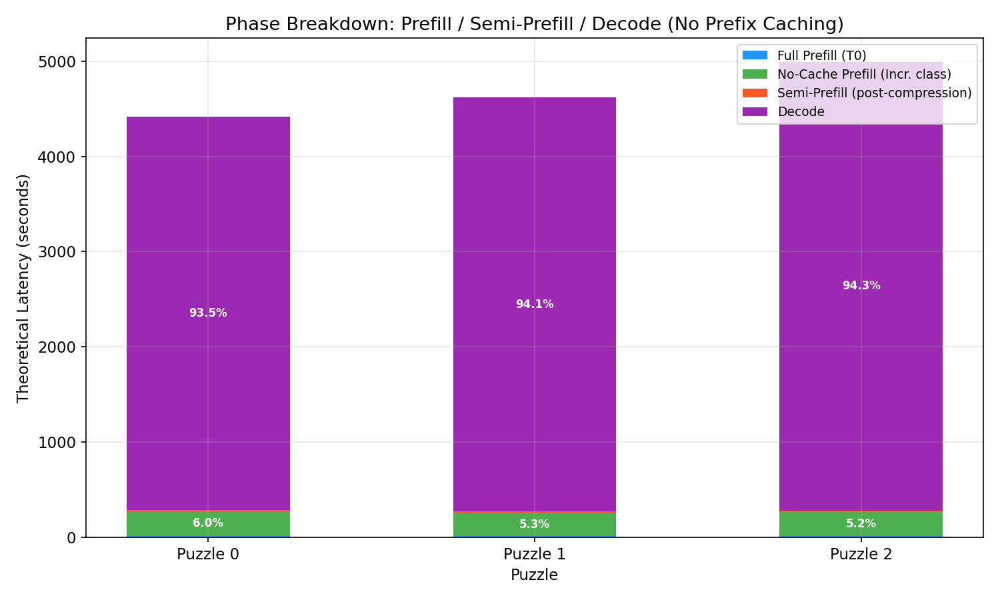

**图表解读（理论模型）**：基于实测 $r_{pf}=0.68$ ms/tok、$r_{dec}=75$ ms/tok 的理论分解。Decode（紫色）占 ~94%，是因为 Decode 速率远慢于 Prefill（~110×）。实测数据中 Semi-Prefill 占比更高（10.5% vs 理论 0.3%），说明实际系统的固定开销和调度延迟远超理论模型。

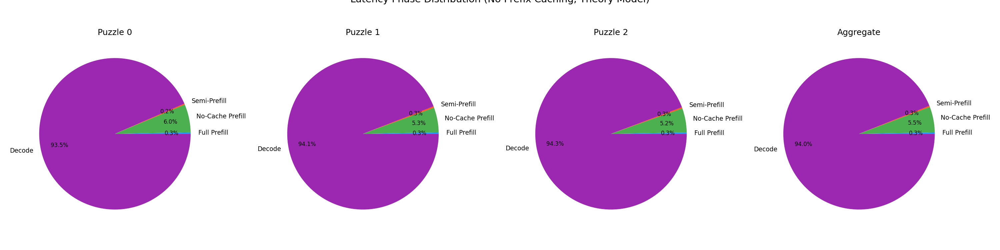

**图表解读**：各 Puzzle 的 Phase 分布和聚合视图。No-Cache Prefill（绿色）虽每轮都发生，但因 prefill 速率极快（~1 500 tok/s），在总额中占比很小。

### 4.3 Prefill-Only 分解（排除 Decode）

> 为了更清晰地评估 prefill 阶段的内部开销结构，下面排除 Decode（87.2%），仅看 Prefill 部分。

| 阶段 | P0-P2 聚合 | 占 Prefill 比例 | 占全轮次比例 |
|------|-----------|----------------|------------|
| Full Prefill | 492.2s | 16.7% | 仅 T0 |
| Semi-Prefill | 2 427.0s | **82.3%** | 13.8% 的轮次触发 |
| **Prefill 合计** | **2 949.7s** | 100% | — |

> 上表基于 `analyze.py` 的步骤级 classification（按 vLLM 返回的分类标签统计）。下表进一步用**实测 TTFT** 分解 Prefill 时间，将 "incremental" 分类的步骤（实际为无 Prefix Cache 的全量 re-prefill）与 Semi-Prefill 步骤分开。

| 阶段 | P0-P2 聚合 (TTFT, ms) | 占 Prefill 比例 |
|------|----------------------|----------------|
| Full Prefill (T0 only) | 72 402 ms | **8.1%** |
| No-Cache Re-Prefill (每轮全量) | 603 152 ms | **67.7%** |
| Post-Compression Prefill (压缩后轻量) | 215 077 ms | **24.2%** |
| **Prefill 合计** | **890 632 ms (14.8 min)** | 100% |

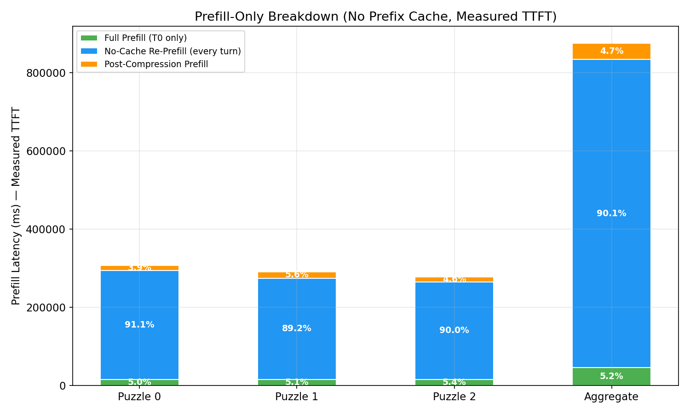

**图表解读（实测 TTFT）**：各 Puzzle + 聚合的 Prefill-Only 时间分解。No-Cache Re-Prefill（蓝色）占主导（67.7%），因为每轮都需完整 re-prefill。Post-Compression Prefill（橙色）仅发生在 13.8% 的轮次但占 24.2%——因为压缩后上下文只有 ~5k tokens，prefill 很快。Full Prefill（绿色）仅 T0 触发，占比很小。

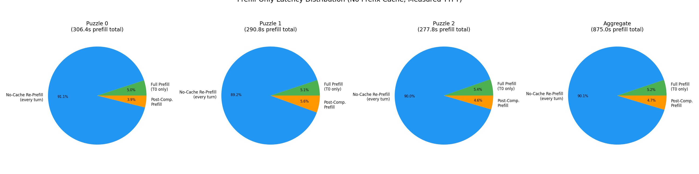

**图表解读**：各 Puzzle 的 Prefill 阶段分布饼图。Puzzle 0 的 Post-Compression 占比最高（32.8%），因为其压缩次数少（3 次）但每次压缩前的上下文较大。与 cw8000 Prefix Cache 启用场景对比：启用 Prefix Cache 后，No-Cache Re-Prefill 将降为 Incremental Prefill（仅处理 δ），Prefill 总量可减少 ~80%。

### 4.4 Per-Turn 延迟特征

#### Agent 调用延迟

| 阶段 | Avg TTFT (ms) | Avg Total (s) | 说明 |
|------|--------------|---------------|------|
| Full Prefill (T0) | 14 500 | 86.1 | 21.5k tok prefill |
| 普通轮（高上下文，>20k tok） | 15 000–21 000 | 130–180 | 每轮重新 prefill 全部上下文 |
| 普通轮（低上下文，~5-12k tok） | 3 000–6 000 | 100–160 | 压缩后的轻量 prefill |
| 压缩轮（agent） | 2 500–2 900 | 100–160 | ~4.3k tok prefill |

#### Host 调用延迟

| 阶段 | Avg TTFT (ms) | Avg Total (s) | 说明 |
|------|--------------|---------------|------|
| 普通 Host | 1 000–1 500 | 150–215 | 仅 2 条消息（system + agent response），prefill 很小 |
| 压缩轮 Host | 1 100–1 500 | 7–280 | 取决于 host 输出长度 |

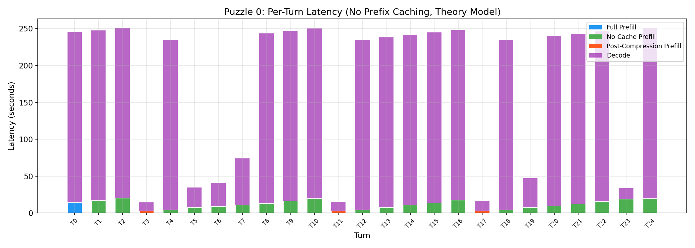
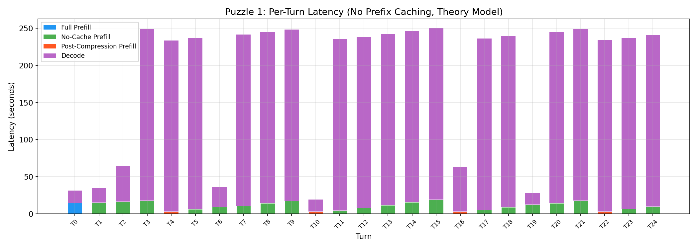
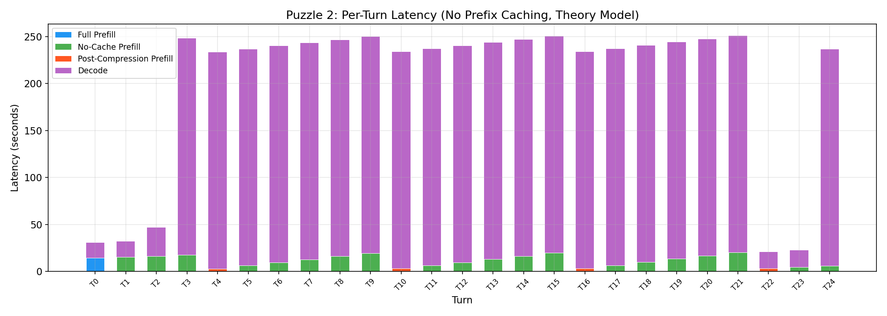

**图表解读**：各 Puzzle 的 Per-Turn 延迟分解（理论模型）。蓝色=Full Prefill，绿色=No-Cache Prefill（每轮全量 prefill），橙色=后压缩 Prefill（~5k tok），紫色=Decode。橙色柱明显短于绿色柱，直观展示压缩对 prefill 的加速效果（~6-8×）。

### 4.5 压缩轮的 TTFT 改善

压缩对 TTFT 的改善非常显著（No Prefix Cache 场景）：

| 指标 | 压缩前最后一轮 | 压缩轮 | 改善 |
|------|-------------|--------|------|
| Agent TTFT | 17 700–21 000 ms | 2 500–2 900 ms | **-85%** |
| Prefill 量 | ~29 000–30 000 tok | ~4 300 tok | **-86%** |

压缩将 agent TTFT 从 ~18 秒降至 ~2.7 秒，改善 **6-8×**。

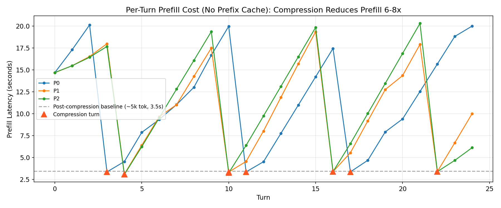

**图表解读**：各 Puzzle 每轮 Prefill 成本曲线。▲ 标记压缩轮——压缩后的 prefill 成本骤降至 ~3s（灰色虚线），而非压缩轮随上下文增长攀升至 ~20s。直观展示了 No Prefix Cache 下压缩的核心价值：阻止 prefill 成本随上下文线性增长。

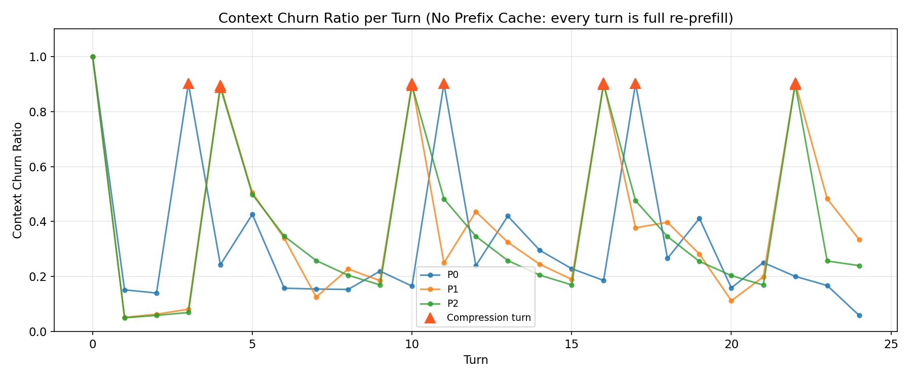

**图表解读**：Context Churn Ratio。在 No Prefix Cache 下，正常轮的 churn 随上下文缓慢下降（因为 delta 不变但分母增大），压缩轮的 churn 骤升至 0.8-1.0（因为几乎所有上下文都被替换为 B2+C1）。▲ 标注压缩事件。

---

## 5 摘要生成成本（Sync 模式）

### 5.1 摘要生成的时间成本

每次压缩事件包含两个阶段：(1) 生成摘要 B₂（同步），(2) 压缩后的 Semi-Prefill。

| 指标 | 值 |
|------|-----|
| 摘要生成平均耗时 | **210.2s**（3.5 分钟） |
| 摘要生成最小/最大 | 117.1s / 299.0s |
| 摘要生成总耗时（11 次） | **2 312.3s**（38.5 分钟） |
| 占 E2E 总时间比例 | **10.0%** |

### 5.2 摘要生成成本分解

| 子阶段 | 操作 | 估算 |
|--------|------|------|
| Summary Prefill | 读入 B₁（~29 000 tok）以生成摘要 | ~29 000 × 0.67ms = ~19.4s |
| Summary Decode | 逐 token 生成摘要 B₂（~1 223 tok） | ~1 223 × 73ms = ~89.3s |
| 固定开销 + 排队延迟 | — | ~101.5s |
| **合计** | | **~210.2s** |

Summary Decode（生成 ~1 223 个摘要 token）是摘要生成的主要成本，占 ~42%。固定开销和排队延迟占 ~48%。

### 5.3 异步摘要的潜在收益

如果摘要生成可以异步完成（后台/空闲时预生成），每次压缩事件的关键路径成本将从 ~210s 降至仅 Semi-Prefill 的 prefill 时间（~2.9s agent TTFT），改善 **72×**。

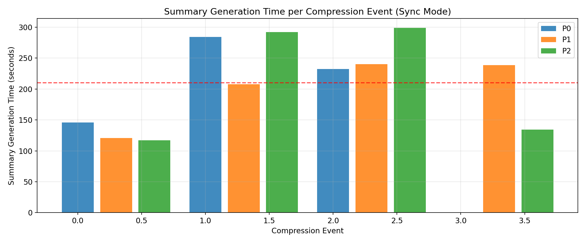

**图表解读**：11 次压缩事件的摘要生成时间。平均 210.2s（红色虚线），范围 117-299s。变异性主要来自 B1 大小（需 prefill 的历史量）和 B2 长度（生成的摘要 token 数）。

---

## 6 核心结论

### 6.1 压缩效果

| 结论 | 数据支撑 |
|------|----------|
| B2/B1 压缩比为 **4.25%**（1/24） | B1 均值 28 881 tok → B2 均值 1 223 tok |
| C1 稳定在 **3 074 tokens** | 所有 11 次压缩事件 C1 恒定为 3 074 |
| 压缩后上下文 ~4 800 tokens | A(481) + B2(1223) + C1(3074) |
| 无 cascade 压缩 | 压缩后 headroom ~25 000 tokens，5-8 轮后再次压缩 |
| 压缩周期 5-8 轮 | δ ≈ 4 700，阈值 30 000，headroom ≈ 25 000 → 5.3 轮 |

### 6.2 每轮增量 δ 控制

| 结论 | 数据支撑 |
|------|----------|
| δ 中位数 **4 753 tokens/轮** | 设计目标 ~4 000，实际偏高 ~19% |
| Agent 输出约 2 300 tok/轮 | 9 000 chars ÷ ~3.9 chars/tok |
| Host 输出约 4 300 tok/轮 | 17 000 chars ÷ ~3.9 chars/tok |
| Host 输出是 agent 的 **1.9×** | host prompt 600-900 tok 目标被大幅超出 |

**改进建议**：当前 host 输出远超目标（600-900 tok → 实际 4 300 tok），是 δ 偏高的主要原因。建议将 host prompt 的 token 目标从 600-900 下调至 300-500，或收紧 MAX_TOKENS 限制。

### 6.3 No Prefix Caching 的影响

| 结论 | 数据支撑 |
|------|----------|
| 每轮 agent 调用都需完整 re-prefill | TTFT 随上下文线性增长 |
| 压缩将 agent TTFT 从 ~18s 降至 ~2.7s | 改善 **6-8×** |
| 无 Prefix Cache 时，Semi-Prefill 占 Prefill 总量的 82.3% | Prefill-Only 分解 |
| 但 Decode 仍占总时间的 87.2% | 与 Prefix Cache 启用时一致 |
| T0 Full Prefill 耗时 ~86s | 21.5k tok × 0.67ms + ~2k tok decode × 73ms |

**本质差异**：在 Prefix Cache 启用时，普通轮的 prefill 仅需处理 δ（~700 tok → ~100ms）；在 No Prefix Cache 时，普通轮的 prefill 需处理完整上下文（~5k-30k tok → 3-21s）。这是 cw8000 报告和本报告之间最大差异的来源。

### 6.4 同步摘要的代价

| 结论 | 数据支撑 |
|------|----------|
| 摘要生成平均耗时 **210.2s** | 11 次压缩的总生成时间 2 312.3s |
| 占 E2E 总时间的 **10.0%** | 2 312.3s / 23 039.6s |
| Summary Decode 约占 42% | ~1 223 tok × 73ms/tok ≈ 89s |
| 异步摘要可消除此开销 | 压缩轮关键路径从 210s → 2.9s |

### 6.5 与 cw8000 参考的关键差异

| 指标 | cw8000 (Prefix Cache ON) | cw32000 (No Prefix Cache) |
|------|--------------------------|---------------------------|
| 上下文窗口 | 8 000 | 32 000 |
| Prefix Caching | 启用 | **禁用** |
| δ 中位数 | 711 tok | **4 753 tok** |
| 普通轮 prefill 量 | δ (~700 tok) | 完整上下文 (~5k-30k tok) |
| 压缩率 | 15.7% | 13.8% |
| B2+C1 均值 | 4 395 tok | 4 297 tok |
| B2/B1 均值 | 约 1 676/B1 | 4.25% (1 223/28 881) |
| Semi-Prefill 占 Prefill | 49.6% | 82.3% |
| 压缩轮 Agent TTFT | ~1 700 ms | ~2 700 ms |

---

## 7 优化方向

1. **启用 Prefix Caching**：移除 `--no-enable-prefix-caching`，使普通轮仅 prefill δ（~4 700 tok 而非 ~20k tok），预期减少 Prefill 时间 60-80%
2. **收紧 Host 输出**：当前 host 实际输出 ~4 300 tok，远超 600-900 目标。建议下调至 300-500 或降低 MAX_TOKENS
3. **异步摘要生成**：将 Summary Decode（210s/次）从关键路径移除，压缩轮延迟可降至 3s 内
4. **减少 C1 的 KV 失效**：如果 B₂ 能以追加方式放在 C1 后面而非替换 B₁，则 C1 的 KV Cache（在 Prefix Cache 启用时）可保留

---

## 附录

- 分析脚本：`/root/agentbench_semi_prefill_bench/analyze.py`
- 原始数据：`/root/agentbench_semi_prefill_bench/results/compressed/`
  - `prompt_logs/` — 每轮完整 prompt 和响应
  - `traces/` — 每轮 agent/host 响应摘要
  - `abc_segments/` — 每次压缩的 A/B1/B2/C1 段分解
  - `timing/` — 每次 LLM 调用的计时信息
  - `agentbench_results/` — 最终结果
- 参考报告：`/root/semi_prefill_bench/results/cw8000_cw8000_rs500/analysis/Semi-Prefill_Overhead分析报告_cw8000.md`
